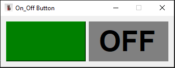
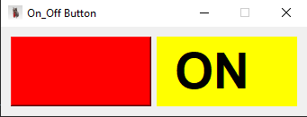

# PyQt5 ON/OFF Button

A simple PyQt5 GUI application that features a single button to toggle between ON and OFF states.

## Features
- Simple and clean user interface
- Toggle button changes the label text from ON to OFF and vice versa

## 🖼️ Screenshot




## About

This project was created as a beginner exercise to learn how to build simple GUI applications using PyQt5.  
The GUI includes a custom icon (`Icon.jpg`) and a toggle button.

## Requirements

- Python 3.x  
- PyQt5

## How to Run

Make sure to download all project files, including the icon image file (`Icon.jpg`) used in the GUI.

To run the program, open your terminal or command prompt, navigate to the project folder, and run:

```bash
python on_off_button.py


